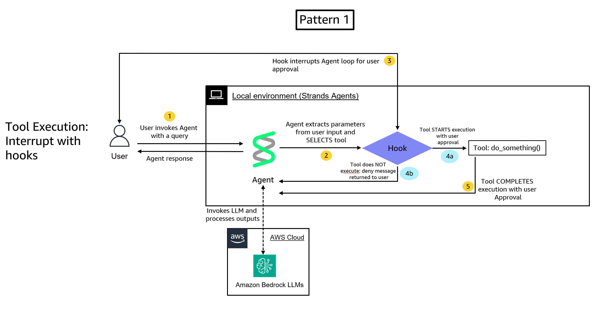

# Human-in-the-Loop (HITL) with Strands Agents

This tutorial demonstrates how to implement human-in-the-loop workflows with Strands Agents. By the end, you'll have built agents that can pause execution, request human input or approval, and resume based on that feedback.

## Architecture




## Tutorial Details

| Information            | Details                                                  |
|------------------------|----------------------------------------------------------|
| **Strands Features**   | Interrupts, Hooks, Tool Context, Session Management, Agent State |
| **Agent Pattern**      | Single agent with human-in-the-loop controls             |
| **Tools**              | Custom tools with interrupt capabilities                 |
| **Model**              | Claude Haiku 4.5 on Amazon Bedrock                        |

## How It Works

1. Agent begins executing a task and encounters a tool call that requires approval
2. A hook intercepts the tool call using BeforeToolCallEvent, triggering an interrupt (second pattern explores triggering interrupt within the tool itself)
3. Execution pauses and control returns to the caller with an interrupt request
4. Human reviews the request and provides approval or denial
5. Agent resumes execution with the human's decision and continues the workflow
6. Session manager persists user preferences for future interactions

## Prerequisites

- Python 3.10 or later
- AWS account with [Amazon Bedrock](https://aws.amazon.com/bedrock/) model access configured
- Basic understanding of Python programming
- Familiarity with Strands Agents basics [(see Quickstart Guide)](https://strandsagents.com/latest/documentation/docs/user-guide/quickstart/)

## Tutorial Structure

```
10-human-in-the-loop/
├── README.md
├── requirements.txt
├── strands_hitl.ipynb
└── images/
    ├── pattern-1.png
    ├── pattern-2.png
```

| File | Description |
|------|-------------|
| [strands_hitl.ipynb](./strands_hitl.ipynb) | Interactive notebook demonstrating three HITL patterns |

## What You'll Learn

The [strands_hitl.ipynb](./strands_hitl.ipynb) notebook in this directory covers:

- **Understanding Interrupts**: Learn how the interrupt system pauses and resumes agent execution
- **Hook-Based Approvals**: Create approval workflows that intercept tool calls before execution
- **Tool-Based Interrupts**: Raise interrupts directly from within your tool definitions
- **Session Persistence**: Remember user preferences across sessions with FileSessionManager

## Installation

Install the required dependencies:

```bash
pip install -r requirements.txt
```

## Running the Examples

1. Open the notebook: [strands_hitl.ipynb](./strands_hitl.ipynb)
2. Run cells sequentially to see each pattern in action
3. Interact with the approval prompts when requested

## Key Concepts

- **Interrupts**: Mechanisms to pause agent execution and request human input
- **Hooks**: Intercept tool calls before execution using BeforeToolCallEvent
- **Tool Context**: Access interrupt functionality from within tools using tool_context.interrupt()
- **Session Management**: Persist interrupt state and user preferences across sessions
- **Agent State**: Store and retrieve user preferences with agent.state.set() and agent.state.get()

## Important Notes

- Interrupt names must be unique within their scope (hook or tool)
- A single hook/tool can raise multiple interrupts sequentially, not simultaneously
- All concurrently running tools can raise interrupts independently

## Additional Resources

- [Strands Agents Documentation](https://strandsagents.com/)
- [Quickstart Guide](https://strandsagents.com/latest/documentation/docs/user-guide/quickstart/)
- [Strands Interrupts Documentation](https://strandsagents.com/latest/documentation/docs/user-guide/concepts/interrupts/)

## Next Steps

- Explore [Multi-Agent Systems](../../02-multi-agent-systems/) to combine HITL with orchestration patterns
- Learn about [Memory and Persistent Agents](../07-memory-persistent-agents/) for long-running workflows
- Review [Observability and Evaluation](../08-observability-and-evaluation/) to monitor HITL interactions